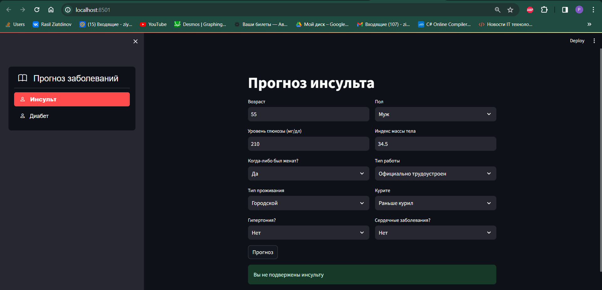

# Итоговый проект по дисциплине "Программирование Python"
Проект представдяет из себя веб-приложение для оценки подверженности заболеваниям инсульта и сахарного диабета
Модели были обучены на основе наборов данных представленных в каталоге .\datasets
## Руководство по запуску веб приложения
1. Установить и активировать виртуальную среду
```
python -m venv venv
venv\Scripts\activate
```
2. Установить необходимые библиотеки
```
pip install -r requirements.txt
```
3. Запустить приложение
```
streamlit run app.py
```
## Запущенное приложение

